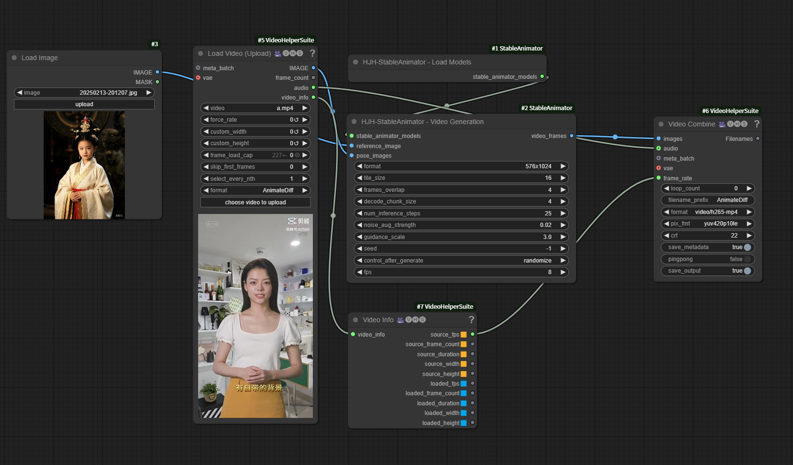

English | [中文版](https://github.com/HJH-AILab/ComfyUI_StableAnimator/blob/main/README.cn.md)

# ComfyUI_StableAnimator
Custom nodes for ComfyUI of StableAnimator.

Visit the original project at https://github.com/Francis-Rings/StableAnimator.

## Features
1. The model loading node has been made independent, which complies with the ComfyUI caching mechanism.
2. A node for exporting bone maps from video frames of StableAnimator has been created. You can also use the DWPose Estimator of comfyui_controlnet_aux to generate bone maps.
3. A node for reading bone maps from a directory has been created.
4. The nodes can now be used normally.

## Workflow
the workflow json at <a href="workflow/stable_animator_example.json">here</a>
<br>


## Suggestions
1. It is recommended to use ComfyUI - VideoHelperSuite to export video frames and synthesize videos. Refer to: https://github.com/Kosinkadink/ComfyUI-VideoHelperSuite.
2. On personal devices (devices with smaller video memory), it is recommended to run the processes of exporting bone maps and generating action videos separately.

## Installation
1. Pull this project to ComfyUI/custom_nodes.
2. Pull StableAnimator to ComfyUI/custom_nodes/ComfyUI_StableAnimator/StableAnimator.
3. Install the dependencies according to the steps in the README of the StableAnimator project. Refer to: https://github.com/Francis-Rings/StableAnimator.

## Models Local Folder
```
stable_animator
        /Animation
                face_encoder.pth
                pose_net.pth
                unet.pth
        /antelopev2
                1k3d68.onnx
                2d106det.onnx
                genderage.onnx
                glintr100.onnx
                scrfd_10g_bnkps.onnx
        /DWPose(ControlNet DW PreProcessor nodes using Contrelnet can leave this out)
                dw-ll_ucoco_384.onnx
                yolox_l.onnx
        /stable-video-diffusion-img2vid-xt
                svd_xt_image_decoder.safetensors
                svd_xt.safetensors
                model_index.json
                /feature_extractor
                        preprocessor_config.json
                /image_encoder
                        config.json
                        model.fp16.safetensors
                        model.safetensors
                /scheduler
                        scheduler_config.json
                /unet
                        config.json
                        diffusion_pytorch_model.fp16.safetensors
                        diffusion_pytorch_model.safetensors
                /vae
                        config.json
                        diffusion_pytorch_model.fp16.safetensors
                        diffusion_pytorch_model.safetensors
```
Add stable_animator: your stable_animator model storage root directory entry to comfyui extra_model_paths.yam

## Reward
Our team's reward code:


